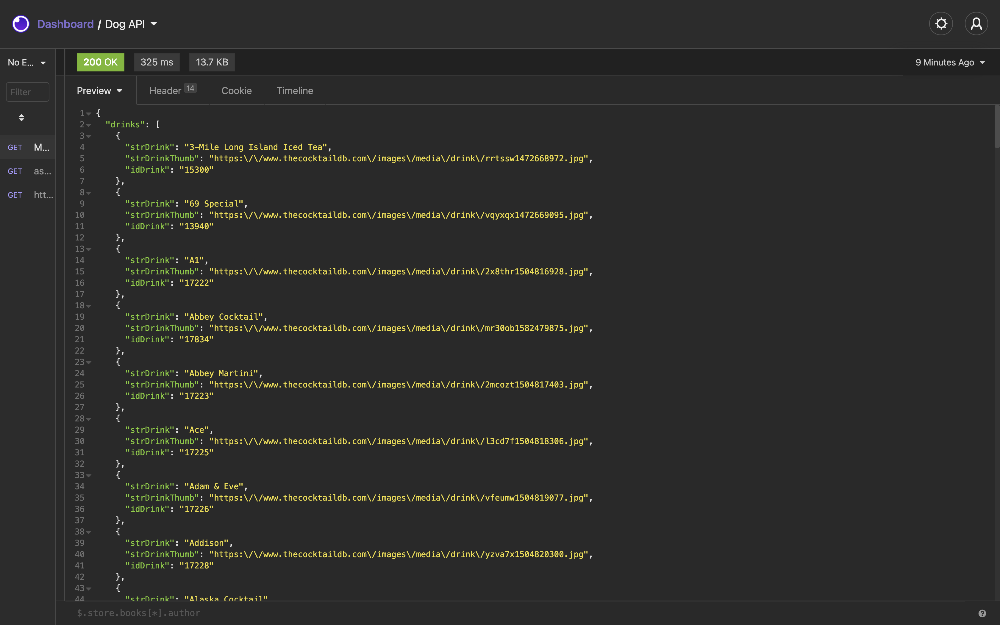
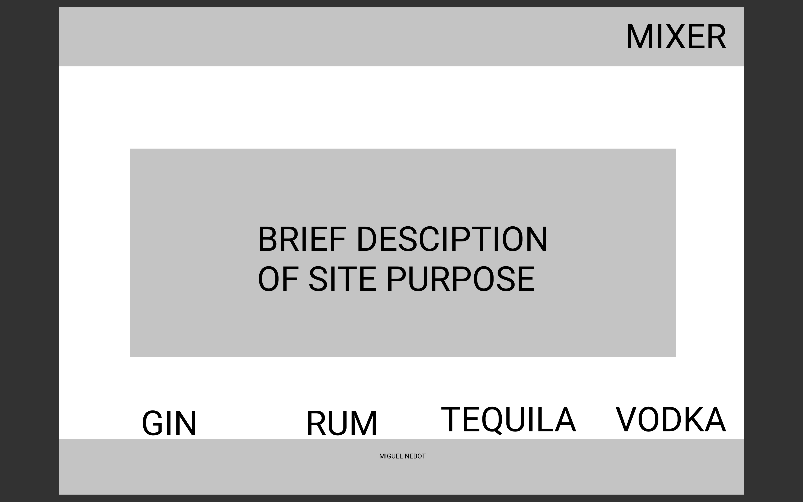
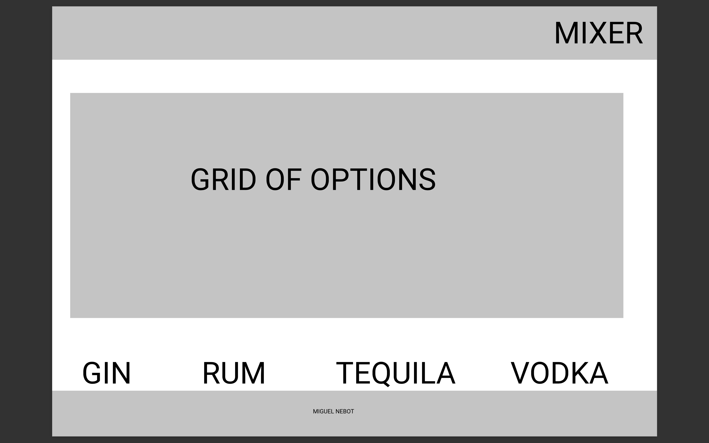
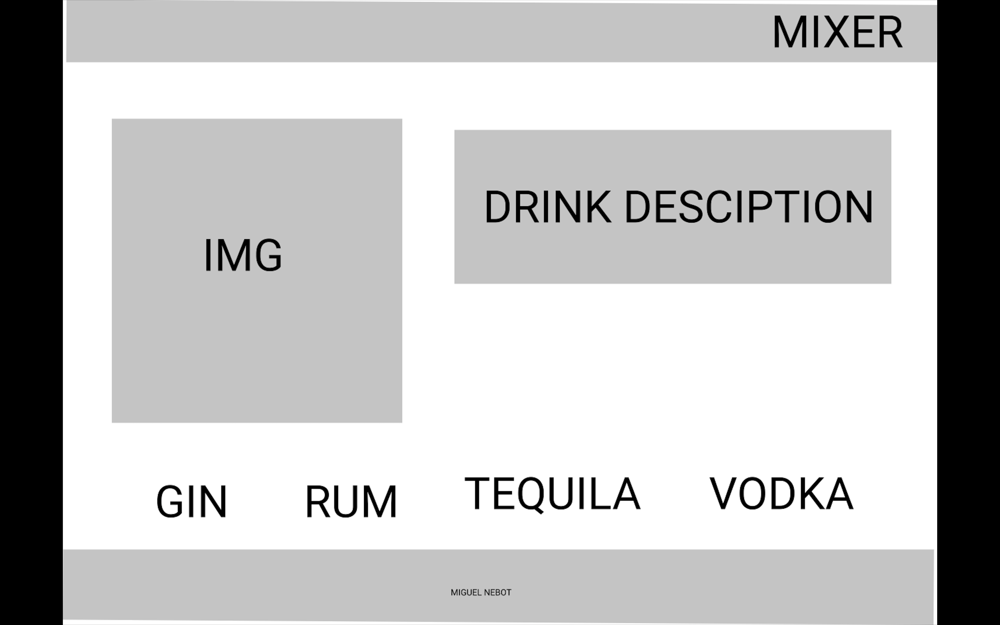
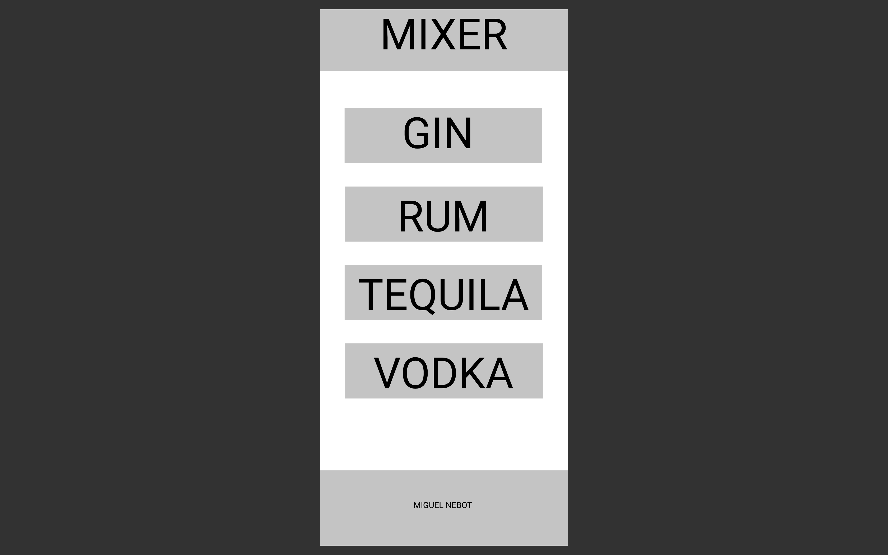
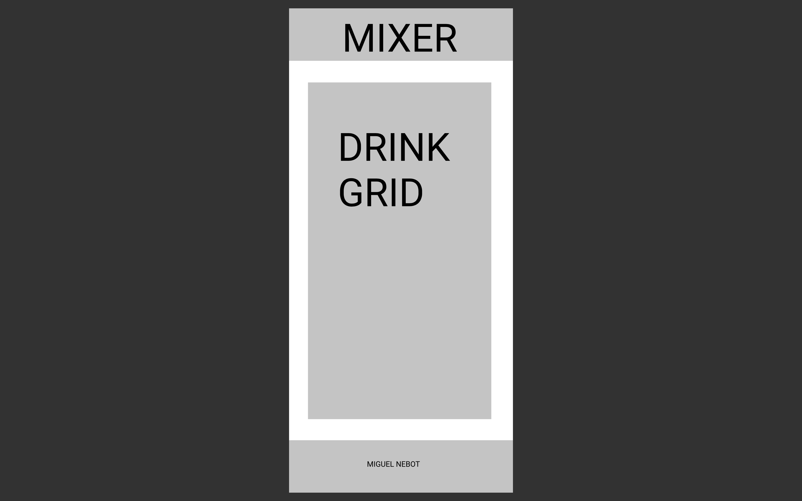
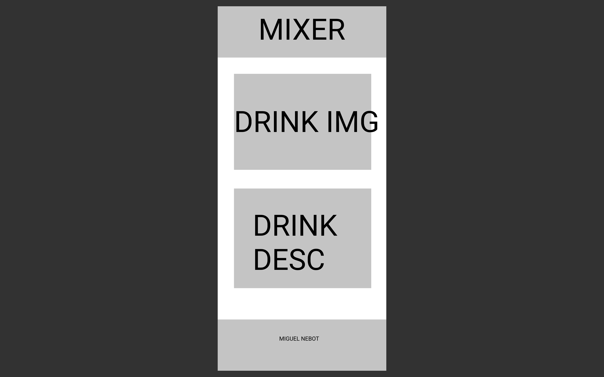
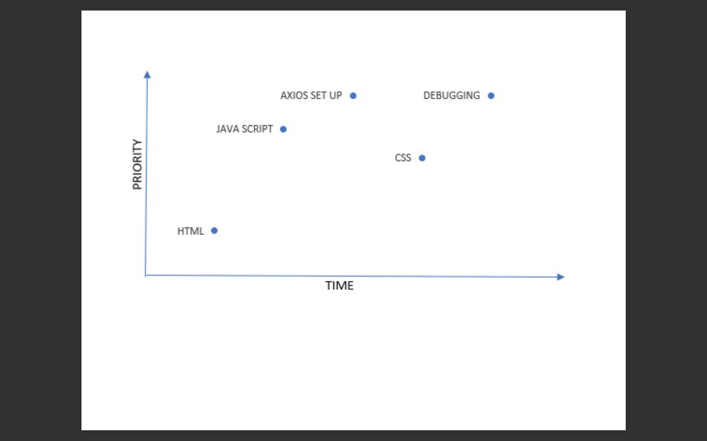

#  Mixer

### Description
Mixer is an app that will search up mix drink recipes depending on the liquor is selected.

## Api Source 
www.thecocktaildb.com/api/json/v1/1/filter.php?i=Gin
www.thecocktaildb.com/api/json/v1/1/filter.php?i=Vodka
www.thecocktaildb.com/api/json/v1/1/filter.php?i=Rum
www.thecocktaildb.com/api/json/v1/1/filter.php?i=Tequila

## API Snippet 

## Wireframe

## MVP
Html
Axios Calls
Css with grid

## Post MVP
Random Drink Selector
Search by first Letter

## Goals
| Date  | Task                                              |
|-------|:-------------------------------------------------:|
|6/8    | Pitch Approved / Structure HTML / Axios Calls     |
|6/9    | Complete Styling  of Home page / Write description|
|6/10   | Adding on click event listener to drink buttons   |
|6/11   |Style the grid where the drink option will show    |
|6/12   |Debugging                                          |
|6/13   |Cleaning up pseudos code and console.logs          |
|6/14   |Presentation                                       |

## Priorty Matrix

## Timeframes
|Task     | Time     |
|--------:|:--------:|
|Html     | 2 hrs    |
|AxiosCall| 3hrs     |
|JS       | 3hrs     |
|Css      | 3hrs     |