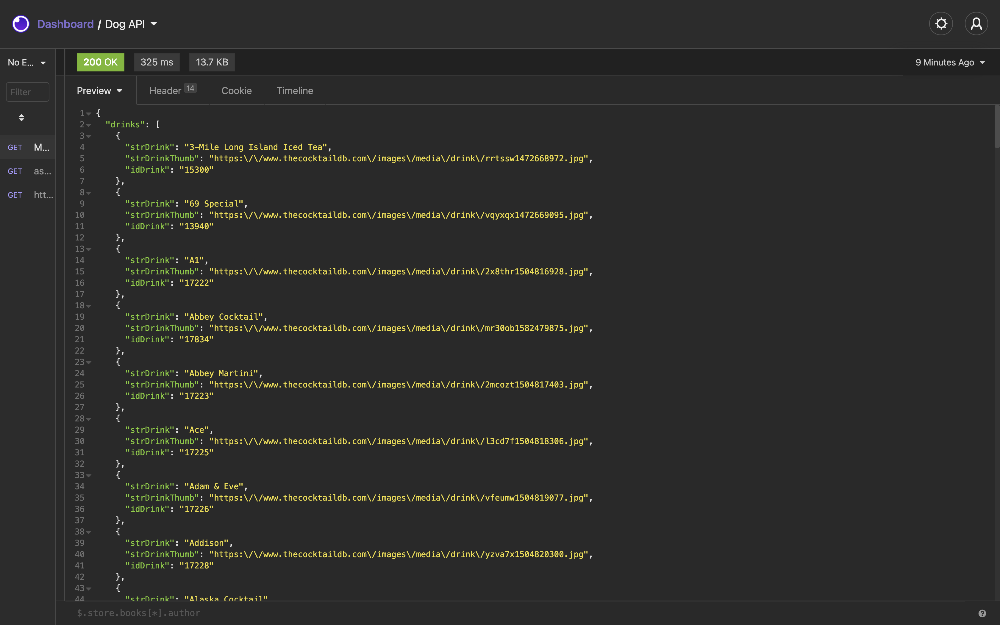
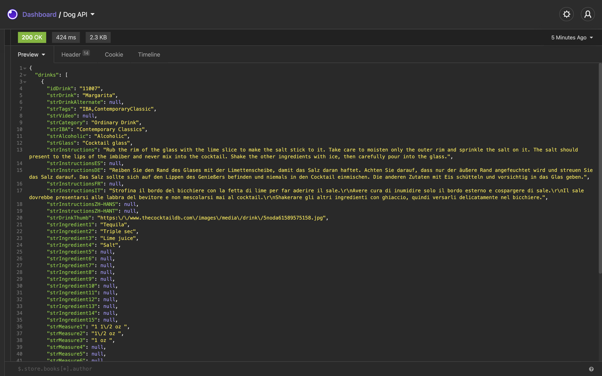
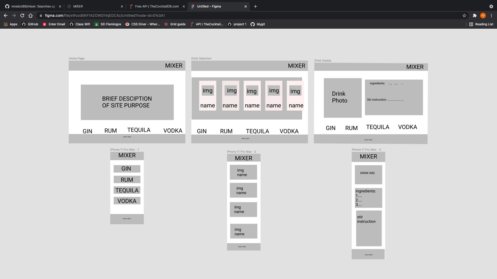
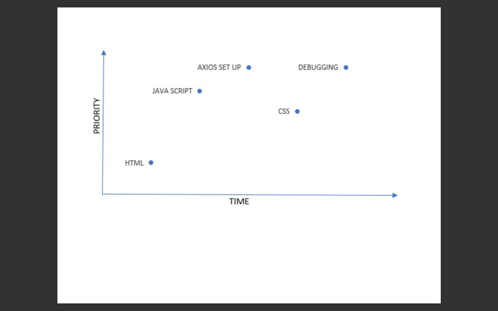

#  Mixer

### Description
Ever go out to a bar or club with friends and not know what to ask the bartender for? Maybe, your hosting a shindig at your home and you have a cabinet full of bottles, but you don't how to blend them into deliciousness. 
Mixer will bring out your inner bartender. Pick the base alcohol you have. Mixer will generate a list of cocktails with ingredients and stir instructions. 

## Api Source 
#### Search by ingredients
www.thecocktaildb.com/api/json/v1/1/filter.php?i=Gin
www.thecocktaildb.com/api/json/v1/1/filter.php?i=Vodka
www.thecocktaildb.com/api/json/v1/1/filter.php?i=Rum
www.thecocktaildb.com/api/json/v1/1/filter.php?i=Tequila
#### Sample of cocktail details 
www.thecocktaildb.com/api/json/v1/1/lookup.php?i=11007

## API Snippet 

## Wireframe

## MVP
Html
Axios Calls
Css with grid

## Post MVP
Random Drink Selector
Search by first Letter

## Goals
| Date  | Task                                              |
|-------|:-------------------------------------------------:|
|6/8    | Pitch Approved / Structure HTML / Axios Calls     |
|6/9    | Complete Styling  of Home page / Write description|
|6/10   | Adding on click event listener to drink buttons   |
|6/11   |Style the grid where the drink option will show    |
|6/12   |Debugging                                          |
|6/13   |Cleaning up pseudos code and console.logs          |
|6/14   |Presentation                                       |

## Priorty Matrix

## Timeframes
|Task                          | Time  |
|-----------------------------:|:-----:|
|Html:adding classes and Ids   | 2 hrs |
|event listener/ Dom           | 3 hrs |
|add 2 axios calls             | 3 hrs |
|styling event buttons         | 2 hrs |
|The layout for drink grid     | 2 hrs |
|styling the ingredient page   | 2 hrs |
|researching / reviewing       | 3 hrs |
|Css/grid/flex                 | 3 hrs |
|Debugging                     | 5 hrs |